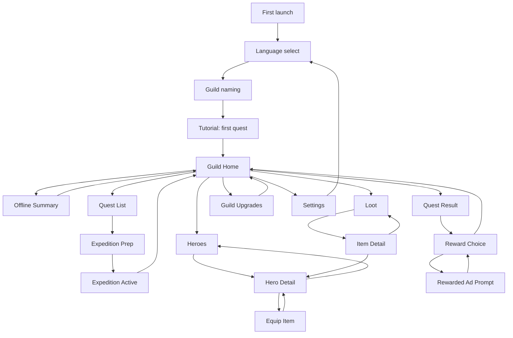

# UX Flow And Screen Map

Last updated: 2026-06-21

This document defines the first mobile UX shape for Badventurers. It is a navigation and screen-flow mockup, not a final art direction.

## UX Goal

The player should always understand three things:

- What came back from the last expedition.
- What can be improved right now.
- What should be sent out next.

Badventurers is an idle RPG, so the interface should be calm, readable, and fast. The player comes back often, makes a few profitable decisions, and leaves another party doing something unwise.

## Primary Navigation

The MVP should use a bottom navigation with five main destinations:

- Guild: home, resources, active expedition, recent journal.
- Quests: available expeditions and expedition prep.
- Heroes: roster, hero detail, equipment shortcuts.
- Loot: inventory, item detail, equip or sell.
- Upgrades: guild facilities and longer-term progression.

Shop, settings, language, and monetization screens are secondary and should not dominate the main loop.

## Core Screen Flow

## Main Loop

1. Player opens the app.
2. If expeditions completed while away, show Offline Summary.
3. Player lands on Guild Home.
4. Player collects expedition result.
5. Player reviews reward and optional rewarded-ad bonus.
6. Player equips loot or upgrades guild.
7. Player starts a new expedition.
8. App can be closed with a clear active timer.

## Screen List

### First Launch

Purpose: choose language and create the first guild.

Key elements:

- Language choice: English / Francais.
- Guild name field.
- Short identity line: "A guild of professionals, legally speaking."
- Continue button.

Exit: starts the tutorial quest.

### Guild Home

Purpose: central dashboard for the return loop.

Key elements:

- Resources: gold, reputation, guild level.
- Active expedition card or completed expedition card.
- Primary action: collect, start quest, or view active quest.
- Recent journal entries.
- Quick upgrade recommendation.
- Optional small shop/settings access.

Exit:

- Quest List.
- Quest Result if an expedition is complete.
- Heroes.
- Loot.
- Upgrades.

### Offline Summary

Purpose: reward the player for returning.

Key elements:

- Time away.
- Completed expedition count.
- Gold, XP, loot, and incidents.
- Continue button.
- Optional rewarded ad to double selected loot or gold.

Exit: Guild Home.

### Quest List

Purpose: choose the next expedition.

Key elements:

- Quest cards with duration, risk, main reward, and tags.
- Locked quests shown but not noisy.
- Recommended quest marker.
- Party power hint.

Exit: Expedition Prep.

### Expedition Prep

Purpose: pick party, understand odds, start timer.

Key elements:

- Selected quest summary.
- Party slots.
- Success estimate.
- Risk notes.
- Start expedition button.
- Optional "finish now" disabled until monetization prototype.

Exit: Guild Home with active expedition.

### Quest Result

Purpose: give payoff and comedy.

Key elements:

- Outcome title.
- Short journal summary.
- Rewards list.
- Injuries or complications.
- Buttons: collect, double reward with ad, inspect loot.

Exit:

- Guild Home.
- Rewarded Ad Prompt.
- Loot or Hero Detail when inspecting a reward.

### Heroes

Purpose: roster management.

Key elements:

- Hero cards with class, level, role, power, trait.
- Sort/filter later.
- Injured or busy state.
- Recruit slot later.

Exit: Hero Detail.

### Hero Detail

Purpose: understand and improve one hero.

Key elements:

- Hero identity, class, level.
- Stats.
- Trait list.
- Equipment slots.
- Upgrade/promotion action later.

Exit:

- Equip Item.
- Heroes.
- Quest Prep if assigning directly later.

### Loot

Purpose: inspect, equip, and sell items.

Key elements:

- Inventory list.
- Rarity color.
- Slot filter.
- Compare hint.
- Item actions.

Exit:

- Item Detail.
- Hero Detail after equip.

### Item Detail

Purpose: decide what to do with a specific item.

Key elements:

- Name, rarity, slot.
- Stat modifiers.
- Flavor text.
- Best hero suggestion.
- Equip, sell, keep buttons.

Exit:

- Hero Detail.
- Loot.

### Guild Upgrades

Purpose: long-term progression and gold sink.

Key elements:

- Facility cards.
- Cost, benefit, level.
- Recommended upgrade.
- Locked future facilities.

Exit: Guild Home.

### Shop

Purpose: optional monetization without hijacking the loop.

Key elements:

- No-ads purchase.
- Cosmetic guild themes.
- Starter pack.
- Rewarded ad shortcuts.

Exit: Guild Home.

### Settings

Purpose: account, language, audio, legal, privacy.

Key elements:

- Language selector.
- Sound/music toggles.
- Privacy policy.
- Restore purchases.
- Credits.

Exit: Guild Home or Language Select.

## Bottom Navigation Behavior

- Guild is the default landing screen.
- Quests is the fastest route to spending time.
- Heroes and Loot support optimization.
- Upgrades creates long-term goals.
- A completed expedition should create a visible badge on Guild and Quests.

## MVP Screen Priority

1. Guild Home.
2. Quest List.
3. Expedition Prep.
4. Quest Result.
5. Heroes.
6. Hero Detail.
7. Loot.
8. Guild Upgrades.
9. Offline Summary.
10. Settings.
11. Shop.

## Mockup

Open the clickable low-fidelity mockup here:

- `docs/mockups/mobile-flow.html`

