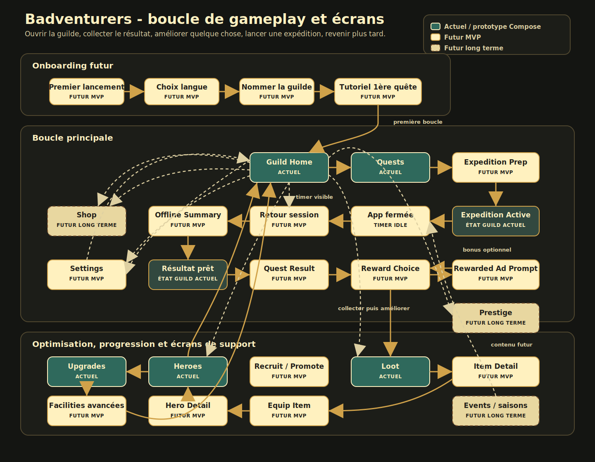
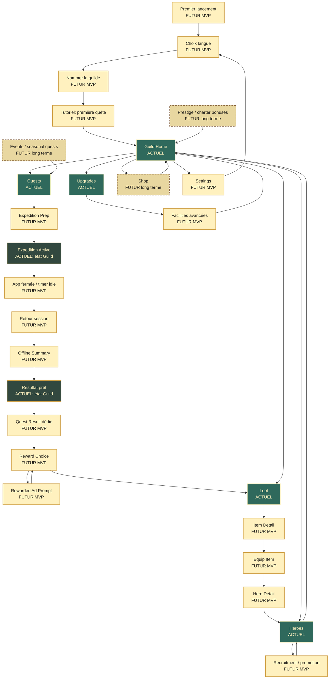

# Gameplay Screen Loop

Last updated: 2026-06-22

Ce document complète `08-ux-flow.md` avec une vue graphique de la boucle de gameplay et des écrans prévus ensuite. Il distingue les écrans déjà présents dans le prototype Compose des écrans futurs attendus pour le MVP et les phases suivantes.

## Graphique

## Lecture rapide

- Actuel: écran, onglet ou état déjà présent dans l'application Android.
- Futur MVP: écran nécessaire pour rendre la boucle répétable et plus claire.
- Futur long terme: écran prévu pour la monétisation, la rétention ou la progression avancée.

La boucle principale doit rester simple: ouvrir la guilde, récupérer le résultat, améliorer quelque chose, lancer une nouvelle expédition, puis revenir plus tard.

## Diagramme éditable

## Écrans à garder dans le scope

| Priorité | Écran | Statut | Rôle dans la boucle |
| --- | --- | --- | --- |
| 1 | Guild Home | Actuel | Hub de retour, ressources, expédition active, journal récent. |
| 2 | Quests | Actuel | Choix de la prochaine expédition. |
| 3 | Expedition Prep | Futur MVP | Choix du groupe, estimation de succès, lancement clair. |
| 4 | Expedition Active | Actuel comme état Guild | Timer visible et promesse de retour. |
| 5 | Offline Summary | Futur MVP | Récompense le joueur qui revient après absence. |
| 6 | Quest Result | Futur MVP | Payoff lisible: outcome, journal, loot, complications. |
| 7 | Reward Choice | Futur MVP | Collecter, inspecter, éventuellement doubler une récompense. |
| 8 | Loot / Item Detail / Equip Item | Actuel puis Futur MVP | Transformer le résultat en amélioration concrète. |
| 9 | Heroes / Hero Detail | Actuel puis Futur MVP | Comprendre et optimiser le groupe. |
| 10 | Upgrades / Facilities | Actuel puis Futur MVP | Dépenser l'or et créer des objectifs longs. |
| 11 | Settings / Shop | Futur | Support, langue, achats, pubs optionnelles. |
| 12 | Events / Prestige | Futur long terme | Rétention, contenu saisonnier, progression avancée. |
