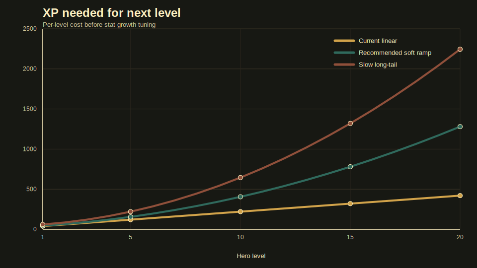
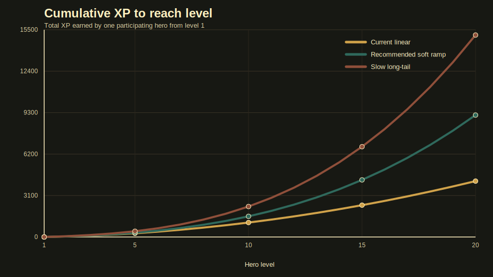
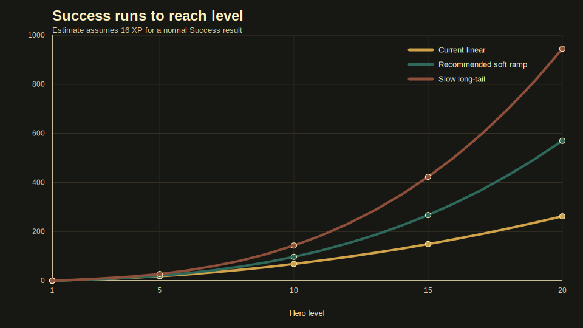

# Hero XP Progression Curves

Last updated: 2026-06-23

This note compares candidate XP curves before implementing stat growth. The current prototype already stores per-hero XP and grants quest XP to participating heroes; this document is for agreeing on pacing before level-ups change power.

## Assumptions

- XP is earned by participating heroes only.
- A normal `Success` gives 16 XP, `Great Success` gives 24 XP, `Partial Success` gives 10 XP, `Failure` gives 5 XP, and `Ridiculous Failure` gives 3 XP.
- The run-count chart uses 16 XP per run as a readable baseline, not as a balance guarantee.
- The curve charts do not include Training Yard bonus XP, future rested XP, promotions, duplicate currency, or offline catch-up. The prototype now applies +10% quest XP per extra Training Yard level when a result is collected.

## Candidate Curves

| Curve | Formula for next-level XP | Design read |
| --- | --- | --- |
| Current linear | `40 + 20 * n` | Fast prototype curve. Good for seeing levels quickly, likely too fast once levels grant stats. |
| Recommended soft ramp | `45 + 20 * n + 5 * n * (n - 1) / 2` | Still friendly early, slows enough to make level 8+ feel earned. |
| Slow long-tail | `60 + 25 * n + 5 * n * (n - 1)` | Safer if level-ups are very strong, but risks feeling grindy before the rest of progression exists. |

`n` is `level - 1`.

## Charts

## Numeric Table

| Level | Current next XP | Recommended next XP | Slow next XP | Current cumulative | Recommended cumulative | Slow cumulative |
| ---: | ---: | ---: | ---: | ---: | ---: | ---: |
| 1 | 40 | 45 | 60 | 0 | 0 | 0 |
| 2 | 60 | 65 | 85 | 40 | 45 | 60 |
| 3 | 80 | 90 | 120 | 100 | 110 | 145 |
| 4 | 100 | 120 | 165 | 180 | 200 | 265 |
| 5 | 120 | 155 | 220 | 280 | 320 | 430 |
| 6 | 140 | 195 | 285 | 400 | 475 | 650 |
| 7 | 160 | 240 | 360 | 540 | 670 | 935 |
| 8 | 180 | 290 | 445 | 700 | 910 | 1295 |
| 9 | 200 | 345 | 540 | 880 | 1200 | 1740 |
| 10 | 220 | 405 | 645 | 1080 | 1545 | 2280 |
| 11 | 240 | 470 | 760 | 1300 | 1950 | 2925 |
| 12 | 260 | 540 | 885 | 1540 | 2420 | 3685 |
| 13 | 280 | 615 | 1020 | 1800 | 2960 | 4570 |
| 14 | 300 | 695 | 1165 | 2080 | 3575 | 5590 |
| 15 | 320 | 780 | 1320 | 2380 | 4270 | 6755 |
| 16 | 340 | 870 | 1485 | 2700 | 5050 | 8075 |
| 17 | 360 | 965 | 1660 | 3040 | 5920 | 9560 |
| 18 | 380 | 1065 | 1845 | 3400 | 6885 | 11220 |
| 19 | 400 | 1170 | 2040 | 3780 | 7950 | 13065 |
| 20 | 420 | 1280 | 2245 | 4180 | 9120 | 15105 |

## Success-Run Estimate

Estimated number of normal Success results needed for one hero to reach a target level from level 1.

| Target level | Current linear | Recommended soft ramp | Slow long-tail |
| ---: | ---: | ---: | ---: |
| 2 | 3 | 3 | 4 |
| 3 | 7 | 7 | 10 |
| 4 | 12 | 13 | 17 |
| 5 | 18 | 20 | 27 |
| 6 | 25 | 30 | 41 |
| 7 | 34 | 42 | 59 |
| 8 | 44 | 57 | 81 |
| 9 | 55 | 75 | 109 |
| 10 | 68 | 97 | 143 |
| 11 | 82 | 122 | 183 |
| 12 | 97 | 152 | 231 |
| 13 | 113 | 185 | 286 |
| 14 | 130 | 224 | 350 |
| 15 | 149 | 267 | 423 |
| 16 | 169 | 316 | 505 |
| 17 | 190 | 370 | 598 |
| 18 | 213 | 431 | 702 |
| 19 | 237 | 497 | 817 |
| 20 | 262 | 570 | 945 |

## Decision

Use the recommended soft ramp for the first implementation pass. This is now implemented in `HeroProgression.xpForNextLevel`.

It keeps the first few levels reachable, gives the hero sheet frequent progress early, and avoids the current curve pushing a constantly used hero into high levels too quickly.

Practical target:

- Level 2 after about 3 normal successes.
- Level 3 after about 7 normal successes total.
- Level 5 after about 20 normal successes total.
- Level 10 after about 97 normal successes total.

## Promotion And Duplicate Decision

Promotions and duplicate pull compensation are now defined in [Hero promotion and duplicate rules](18-hero-promotion-duplicate-rules.md). Duplicate pulls keep their immediate reputation reward, then later add hero-specific contracts that feed bounded promotion ranks instead of raw XP.

## Open Tuning Questions

- Should starter heroes keep their current catalog levels, or should all recruited heroes normalize to level 1 with stronger rarity stats?
- Should each level add flat power, stat-specific growth, or both?
- Should deeper Training Yard work add active drills, rested XP, or hero-specific coaching without replacing expedition XP?
