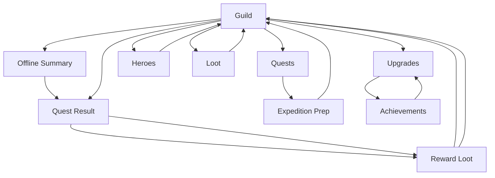

# UX Screen Map

Last updated: 2026-06-25

## Bottom Tabs

| Tab | Purpose | Primary Compose file |
| --- | --- | --- |
| Guild | Return hub, resources, expedition state, core crew, facilities, advice | `app/src/main/java/com/ayoshy/badventurers/ui/GuildScreen.kt` |
| Quests | Quest list, unlocks, recommended heroes, prepare entry | `app/src/main/java/com/ayoshy/badventurers/ui/QuestsPrepScreens.kt` |
| Heroes | Roster, recruitment, recruitment tickets, hero detail, equipment | `app/src/main/java/com/ayoshy/badventurers/ui/HeroesScreen.kt` |
| Loot | Inventory, item detail, sell/equip suggestions | `app/src/main/java/com/ayoshy/badventurers/ui/LootScreen.kt` |
| Upgrades | Facilities and achievement ledger entry | `app/src/main/java/com/ayoshy/badventurers/ui/UpgradesAchievementsScreens.kt` |

## Internal Screens And States

| Screen/state | Purpose | Primary Compose file |
| --- | --- | --- |
| Expedition Prep | Party selection, estimate, plan choice, launch | `QuestsPrepScreens.kt` |
| Quest Result | Outcome, rewards, result causes, level-ups, fake ad hook | `ResultsScreens.kt` |
| Reward Loot | Limited loot recovery choice and capacity breakdown | `ResultsScreens.kt` |
| Offline Summary | Away-time report, passive income, passive incidents, next action | `ResultsScreens.kt` |
| Achievements | Claim rewards and charter milestones | `UpgradesAchievementsScreens.kt` |
| Hero Detail | Hero stats, level progression, equipment picker, release | `HeroesScreen.kt` |

## Shell And Shared UI

- `BadventurersApp.kt`: app shell only. It should keep theme, top-level remembered state, tab routing, and session update wiring. Keep it below 1,000 lines.
- `BadventurersUiArt.kt`: portrait/loot/quest art helpers and rarity borders.
- `BadventurersUiText.kt`: localized UI mapping and label helpers.
- `BadventurersUiLogic.kt`: UI-side selection/equipment helper logic.
- `BadventurersUiComponents.kt`: shared panels, rows, scaffold, and simple widgets.

## Current Flow

